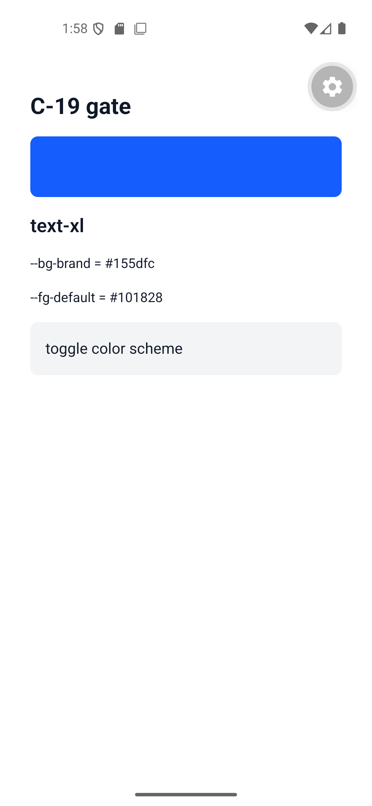
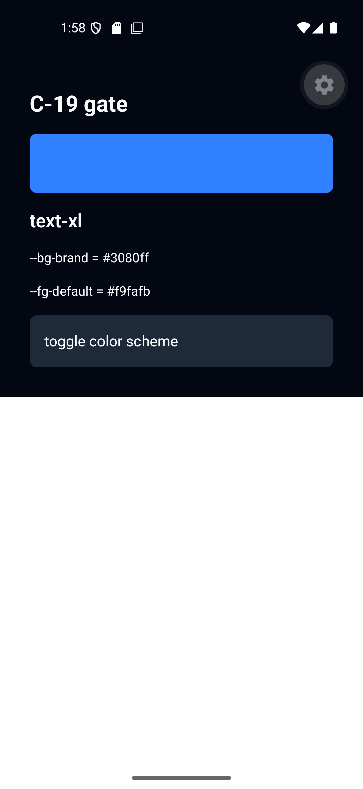

# 착수 게이트 기록

착수 게이트는 두 단계다(CLAUDE.md · [plan.md](plan.md) §2).

- **웹 선확인 (T-W0)** — C-3 래퍼 2건. Phase 1~3의 전제. **완료(2026-09-05)**
- **C-19 게이트 (T-G1 · T-G2)** — NativeWind v5 9항목. Phase 5 착수 전에만 필요하다. **완료(실행 2026-09-06, 기기 확인 2026-09-08)**

---

## 웹 선확인 (T-W0) — 완료

- 일자: 2026-09-05
- 환경: Windows 11 / node 22.12.0 / pnpm 10.28.1 / vite 8.2.2 / tailwindcss 4.3.3 / `@tailwindcss/vite` 4.3.3
- 확인 대상: `apps/verify-vite`. 소비자 전역 CSS는 `src/index.css` 한 파일
- 판정 수단: `pnpm build` 산출 CSS(`dist/assets/*.css`) 문자열 검사

### (1) `@import "@eeennsu/web/themes/base.css"` 한 줄로 tailwindcss 가 web 패키지 peer 로 해석되는가

**통과.** 소비자 CSS가 다음 한 줄뿐인 상태에서 빌드가 성공하고 산출 CSS에 preflight · 토큰 변수 · DS 유틸리티가 모두 들어간다.

```css
@import "@eeennsu/web/themes/base.css";
```

| 확인 항목 | 결과 |
|---|---|
| 빌드 | 성공 (8,141 bytes) |
| preflight 리셋 `*,:after,:before,::backdrop` | 1회 |
| 토큰 `:root` · `.dark` · `@media` 3블록 | `--bg-brand:` 3회 = 3블록 전부 존재 |
| DS 유틸리티 (`bg-canvas` · `text-fg` · `text-md` · `p-4`) | 각 1회 |

pnpm 의 격리된 `node_modules` 레이아웃에서도 래퍼 안의 `@import "tailwindcss"` 가 해석됐다. 소비자는 `tailwindcss` 를 자기 의존성으로 갖고 있고(peer), 래퍼는 그것을 찾아간다.

### (2) 소비자 CSS 에 이미 `@import "tailwindcss"` 가 있을 때 중복 출력이 되는가

**부분 중복. 문제 없음 — 래퍼를 그대로 둔다.**

소비자 CSS를 두 줄로 두고(`@import "tailwindcss";` 다음 줄에 래퍼) 다시 빌드하면:

| 확인 항목 | 한 줄(정본) | 두 줄(중복) |
|---|---|---|
| 산출 CSS 크기 | 8,141 B | 8,382 B (+241) |
| preflight 리셋 `*,:after,:before,::backdrop` | 1회 | 1회 |
| DS 유틸리티 `.bg-canvas{` | 1회 | 1회 |
| `::placeholder` 규칙 | 3회 | 5회 |

중복되는 것은 preflight 안의 `@supports … ::placeholder` 블록 한 쌍뿐이다(+241 B). 주 리셋 블록과 유틸리티는 중복되지 않는다. 값이 동일한 선언이 두 번 나오는 것이라 캐스케이드 결과가 바뀌지 않는다.

**결정**: 래퍼에서 `@import "tailwindcss"` 를 빼지 않는다. C-3 "import 한 줄" 을 그대로 유지하고 T-T2 래퍼 템플릿도 바꾸지 않는다. 스펙이 허용한 대체안(래퍼에서 빼고 소비자에게 순서를 요구)은 쓰지 않는다.

### 남는 것

- 게이트 (8)에서 native 래퍼에 대해 같은 질문을 다시 확인한다. NativeWind v5 문서의 `global.css` 구성이 웹과 다르기 때문이다(§9 S-5, 보류 항목) → **(8)에서 확인 완료. 래퍼 무변경, S-5 종결**

---

## C-19 게이트 (T-G1 · T-G2) — 실행 완료 (2026-09-06)

Phase 5(native) 착수 전에만 필요하다. 9항목은 [plan.md](plan.md) §2.2에 있다. 웹(Phase 1~3)은 이 게이트와 무관하게 진행했다.

**판정 요약**

| # | 항목 | 결과 |
|---|---|---|
| (1) | `@theme inline` | **통과** |
| (2) | `.dark` 루트 셀렉터 | **실패** — 무시된다. R24 개정 대상 |
| (3) | `@source` | **통과** |
| (4) | `:root:not(.light)` | **실패** — `:not(.light)` 이 원인. `:not` 을 뺀 `:root` 는 동작한다. R24 개정 대상 |
| (5) | 복합 폰트 변수 | **부분** — fontSize · fontWeight 통과, lineHeight 실패 |
| (6) | 소비자 `:root` 재선언 last-wins | **통과** — 단 다크 블록 형태가 웹과 다르다((2)·(4)의 귀결) |
| (7) | Expo SDK · RN 버전 | **통과** — SDK 57. 기기 화면 확인 2026-09-08 완료(에뮬레이터 Pixel_4a + Expo Go) |
| (8) | native 래퍼 구성 | **통과** — 래퍼를 그대로 둔다. 발견 2건 기록 |
| (9) | 테스트 환경 className 해석 | **통과(정보)** — 컴포넌트 출처 제한이 붙는다 |

**Phase 5 착수 조건**: (2)·(4) 실패에 대한 스펙 R24 개정 + (7) 수동 확인. **둘 다 완료(2026-09-08). Phase 5 착수 가능.**

**T-N0 반영 (2026-09-08).** 아래 (2)·(4)·(5) 절은 **T-N0 이전의 실측 기록**이다. T-N0 이 `packages/native/themes/*.css` 에 `@media (prefers-color-scheme: dark) { :root }` 블록과 배수 line-height 를 넣은 뒤로 세 항목의 실질 동작이 바뀌었다 — 다크는 래퍼 블록으로 적용되고 `text-<step>` 은 세 값이 다 맞는다. `apps/verify-expo/tests/gate.test.tsx` 의 단언도 그에 맞춰 갱신했다. **NativeWind 자체의 동작은 그대로다**(`.dark` 무시 · `:not(.light)` 실패 · line-height px 오독). 세 절을 남겨 두는 이유는 나중에 NativeWind 가 고쳐졌을 때 무엇이 원래 문제였는지 알기 위해서다.

---

### T-G1 — 게이트 실행 환경

- 일자: 2026-09-06
- 호스트: Windows 11 / node 22.12.0 / pnpm 10.28.1
- 생성: `npx create-expo-app@latest apps/verify-expo --template blank --no-install` (`create-expo-app` 4.0.0)
- 위치: 레포 안 `apps/verify-expo`. pnpm workspace 멤버이며 `@eeennsu/native` 를 `workspace:*` 로 소비한다

**고정한 버전** (C-19 고정 정책 — NativeWind 는 `^` 없이 정확한 버전)

| 패키지 | 버전 | 비고 |
|---|---|---|
| `expo` | `~57.0.20` | SDK 57. 재시도(`blank@sdk-54`) 없이 57로 통과했다 |
| `react-native` | `0.86.3` | |
| `react` | `19.2.3` | |
| `nativewind` | `5.0.0-preview.4` | **정확 버전**. 같은 문자열을 `packages/native/package.json` peer 에 넣었다 |
| `react-native-css` | `3.0.7` | **정확 버전**. `nativewind` peer 는 `^3.0.1` 이지만 게이트 재현성을 위해 고정 |
| `react-native-reanimated` | `4.5.1` | `expo install` 이 SDK 57 호환으로 고른 값 |
| `react-native-safe-area-context` | `~5.7.0` | 〃 |
| `tailwindcss` | `^4.3.3` | `nativewind` peer 는 `>4.1.11` |
| `@tailwindcss/postcss` · `postcss` | `^4.3.3` · `^8.5.28` | |
| `lightningcss` | `1.30.1` | **정확 버전**. `react-native-css` 의 peer(`>=1.27.0`) |
| `jest` · `jest-expo` | `~29.7.0` · `~57.0.5` | |
| `@testing-library/react-native` · `test-renderer` | `^14.0.1` · `^1.2.0` | RNTL 14 는 `render` 가 async 이고 peer 가 `test-renderer` 다 |
| `typescript` | `~6.0.3` | `expo install` 이 SDK 57 기준으로 고른 값. 레포 나머지는 5.9.x |

**설정 파일**

- `metro.config.js` — `withNativewind(getDefaultConfig(__dirname), { input: "./global.css" })`. v5 의 정식 이름은 소문자 w 의 `withNativewind` 이고 `withNativeWind` 는 deprecated 별칭이다
- `postcss.config.mjs` — `@tailwindcss/postcss`
- `nativewind-env.d.ts` — `/// <reference types="nativewind/types" />`
- `babel.config.js` — `babel-preset-expo` 만. v5 는 `nativewind/babel` 프리셋을 제거했다
- `global.css` — 소비자 규칙(C-3)대로 `@import "@eeennsu/native/themes/base.css";` **한 줄**
- `jest.config.js` — `preset: "jest-expo"` + `setupFilesAfterEnv: ["<rootDir>/jest.setup.js"]`. 앱 `test` 스크립트는 `tsc --noEmit && jest`
- `tsconfig.json` — `expo/tsconfig.base` + `strict` + `types: ["node", "jest"]` + **`customConditions: []`**. expo 기본값 `["react-native"]` 이면 tsc 가 `react-native-css` 의 원본 `.ts` 를 그대로 읽어 그 패키지 내부 타입 오류 4건이 이 앱의 typecheck 를 깨뜨린다. 비우면 `.d.ts` 로 해석돼 `skipLibCheck` 가 덮는다. 런타임 해석은 Metro 가 하므로 영향이 없다. 대신 `useUnstableNativeVariable` 이 web 구현(`() => never`)으로 타이핑되므로 `App.tsx` 에서 한 번 캐스팅한다
- `globals.d.ts` — `declare module "*.css"`. `import "./global.css"` 사이드이펙트 import 용
- 스캔 스텁 — `packages/native/dist/_gate-stub.js`. T-N1 이 실제 dist 로 대체한다

**계획과 갈린 점 2건** (상세는 [implementation-notes.md](implementation-notes.md))

1. `lightningcss` 고정을 `package.json` 의 `"overrides"` 가 아니라 **정확 버전 직접 devDependency** 로 했다. pnpm workspace 에서 멤버 패키지의 `overrides` 필드는 무시되고 루트 `pnpm.overrides` 만 먹는데, 루트에 넣으면 웹 쪽 Tailwind 까지 같이 묶인다. `lightningcss` 는 `react-native-css` 의 peer 라 직접 의존성으로 두면 같은 고정 효과가 난다
2. 스텁이 `bg-brand` 한 줄이 아니라 게이트가 쓰는 클래스 어휘 전체를 담는다. (3) 의 판정은 "스텁에만 있는 클래스"(`mt-6` · `text-fg-muted` · `bg-danger`)로 하므로 격리는 그대로다

**완료 조건 확인**

- `pnpm --filter verify-expo test` — `tsc --noEmit` + jest 20개 통과(게이트 19 + smoke 1). T-G1 완료 조건인 "빈 테스트 1개"는 smoke 다
- `npx expo export --platform android` — 성공(1,105 모듈, 2.7 MB hbc). 번들 문자열에 `#155dfc`(= `--bg-brand` 라이트 값)와 DS 클래스 이름이 들어 있다. **jest 경로뿐 아니라 실제 Metro 경로에서도 토큰이 흐른다**
- 기기 부팅(`npx expo start` → Android) — **완료(2026-09-08).** 아래 (7) 참조

**설치 중 남은 peer 경고 2건** (게이트 판정에 영향 없음, 기록만)

- `@react-native/community-cli-plugin@0.86.3` 이 `@react-native/metro-config@0.86.3` 을 요구하는데 0.87.1 이 설치된다
- `react-dom@19.2.8` 이 `react@^19.2.8` 을 요구하는데 19.2.3 이 설치된다

---

### 판정 수단

plan §2.1 이 정한 두 가지 중 **(a) jest-expo + RNTL** 로 (1)~(6)·(8)·(9)를 판정했다. **(b) 기기 화면은 2026-09-08 에 실행했고 (7) 절에 있다.**

(a) 를 쓰려면 두 가지가 필요했다.

1. **CSS 컴파일** — `apps/verify-expo/tests/gate-css.ts` 가 `global.css` 를 `@tailwindcss/postcss` 로 컴파일하고, 그 결과를 `react-native-css/jest` 의 `registerCSS` 에 넣는다. 소비자 CSS 를 흉내내는 `extraCss` 를 뒤에 붙일 수 있다(게이트 (6))
2. **다크 전환** — `Appearance.setColorScheme` 은 **jest-expo 에서 no-op 이다.** `NativeAppearance` TurboModule 이 없어 `getColorScheme()` 이 항상 `null` 이고 change 이벤트도 안 뜬다. `jest.setup.js` 가 그 모듈을 최소 모킹하고 `tests/color-scheme.ts` 가 RN 이 네이티브에서 받는 것과 같은 `appearanceChanged` 이벤트를 `DeviceEventEmitter` 로 쏜다. 이 장치 없이 판정하면 **(2)·(4) 가 실제와 무관하게 전부 실패로 보인다**

증거 파일: `apps/verify-expo/tests/gate.test.tsx`. 실패로 기록한 항목도 단언이 있다 — NativeWind 가 나중에 고쳐지면 테스트가 깨져서 알려주는 것이 목적이다. T-N0 뒤에는 (2)·(4)·(5) 단언이 "래퍼가 우회한 결과"로 바뀌었다(아래 각 절).

---

### (1) `@theme inline` — 통과

`<View className="bg-brand">` 의 배경이 `:root` 의 `--bg-brand`(= `oklch(54.6% 0.245 262.881)`) 해석값 `#155dfc` 로 나온다. 간격·radius 도 같다 — `p-8` → `padding: 32`, `rounded-md` → `borderRadius: 8`.

`@theme inline { --color-brand: var(--bg-brand) }` 의 `var()` 사슬이 풀린다. C-6 산출물 1본 문구와 C-5b RN 항목, AC-3 를 그대로 둔다.

- 부기: 값은 **빌드 시점에 sRGB 리터럴로 굳는다**(런타임 CSS 변수로 남지 않는다). (6) 의 last-wins 도 빌드 시점 캐스케이드이며, 런타임에 변수를 바꿔 다시 칠하는 경로는 DS 채널이 아니다(C-5b RN 항목이 이미 그렇게 적혀 있다)

### (2) `.dark` 루트 셀렉터 — 실패

`Appearance` 를 다크로 바꿔도 토큰 파일의 `.dark { --bg-brand: … }` 블록이 적용되지 않는다. 배경은 라이트 값 `#155dfc` 에 머문다. 소비자가 직접 쓴 `.dark` 블록도 같다.

RN 에는 루트 클래스라는 개념이 없으므로 `.dark` 셀렉터는 어떤 노드에도 안 걸린다. 예상된 실패다.

- 대신 **`dark:` 유틸리티 변형은 동작한다** — `className="bg-brand dark:bg-danger"` 가 다크에서 `#e7000b`, 라이트에서 `#155dfc` 다. Tailwind 기본 `dark` 변형(`@media (prefers-color-scheme: dark)`)을 react-native-css 가 해석한다
- 계획의 실패 분기대로 (4) 의 `@media` 블록이 대신 동작하는지 확인했다 → 아래

### (3) `@source` — 통과

소비자 `global.css` 는 래퍼 import 한 줄뿐이고 앱 소스에는 없는 클래스가, 래퍼의 `@source "../dist"` 만으로 생성된다.

| 클래스 | 있는 곳 | 생성 |
|---|---|---|
| `mt-6` · `text-fg-muted` · `bg-danger` | 스텁에만 | 생성됨 |
| `bg-surface-hover` · `text-lg` · `p-24` · `shadow-lg` | 어디에도 없음 | 생성 안 됨 |

pnpm 의 심링크 레이아웃에서도 `@source` 가 realpath 로 `packages/native/dist` 를 찾는다. C-3 native 항목과 AC-23 을 그대로 둔다.

### (4) `:root:not(.light)` — 실패 (원인은 `:not(.light)`)

| 소비자 CSS | 다크에서 적용 |
|---|---|
| `@media (prefers-color-scheme: dark) { :root:not(.light) { … } }` | **안 됨** |
| `@media (prefers-color-scheme: dark) { :root { … } }` | **됨** |

`@media (prefers-color-scheme: dark)` 자체는 동작하고 `:not(.light)` 만 걸린다. 계획이 예정한 대체안(native 산출물에서 `:not(.light)` 을 뺀 `:root` 로 낸다)이 실제로 동작함을 확인했다. 웹 파일은 무변경이다.

### (5) 복합 폰트 변수 — 부분 실패 (lineHeight)

`<Text className="text-xl">` 결과:

| 속성 | 토큰 값 | RN 결과 | 판정 |
|---|---|---|---|
| `fontSize` | `--text-xl: 20px` | `20` | 통과 |
| `fontWeight` | `--text-xl--font-weight: 600` | `600` | 통과 |
| `lineHeight` | `--text-xl--line-height: 28px` | **`560`** | 실패 |

react-native-css 가 line-height 의 `px` 를 **단위 없는 배수**로 읽는다 — `20 × 28 = 560`. `1.75rem` 도 마찬가지로 틀린다(`490`). 단위 없는 값을 주면 맞는다:

| `--text-xl--line-height` | RN lineHeight |
|---|---|
| `28px` | 560 |
| `1.75rem` | 490 |
| `1.4` | **28** |

NativeWind 의 `nativewind/theme` 도 이 문제를 알고 `leading-*` 유틸리티만 단위 없는 값으로 덮는데, `text-<step>` 이 내는 line-height 는 덮지 않는다(그 CSS 를 넣어도 560 그대로).

계획의 실패 분기는 "RN Text 어댑터가 JS 토큰 객체에서 세 값을 읽어 `style` 로 넣는다" 였다. 실측이 **두 번째 경로**를 열었다 — (4) 때문에 어차피 native 전용 CSS 분기가 생기므로, 그 분기에서 `--text-<step>--line-height` 를 단위 없는 배수로 내면 어댑터 없이 해결된다.

**2026-09-06 사용자 확정: 두 번째 경로(A)로 간다**([plan.md](plan.md) §2.3 D-31). native 래퍼가 5스텝의 line-height 를 배수로 다시 내고 T-N2 의 Text 는 `text-<step>` 클래스를 그대로 쓴다. 실행은 T-N0.

### (6) 소비자 `:root` 재선언 last-wins — 통과 (다크 블록 형태 제한)

| 소비자 CSS | 라이트 | 다크 |
|---|---|---|
| `:root` 만 | 소비자 값 | 소비자 값(라이트) |
| 웹과 같은 3블록(`:root` / `.dark` / `@media … :root:not(.light)`) | 소비자 라이트 값 | **소비자 라이트 값** — 다크 블록 둘 다 죽는다 |
| RN 용 2블록(`:root` / `@media … :root`) | 소비자 라이트 값 | **소비자 다크 값** |

last-wins 자체는 성립한다. C-5b 의 RN 채널은 유지하되 **다크 블록의 형태가 웹과 다르다** — (2)·(4) 의 직접적 귀결이며 R24 개정에 포함했다. `VariableContextProvider` 재설계는 필요 없다.

### (7) Expo SDK · RN 버전 — 통과 (기기 확인 2026-09-08 완료)

- SDK 57(`create-expo-app@latest`)로 만든 프로젝트에서 (1)~(6)·(8)·(9)가 전부 판정 가능했다. `--template blank@sdk-54` 재시도는 하지 않았다
- `npx expo export --platform android` 가 성공하고 번들에 토큰 값이 들어간다(위 T-G1)
- **기기 화면 확인 (2026-09-08).** Android 에뮬레이터 `Pixel_4a`(API 33, 1080x2340) + Expo Go SDK 57.0.0. `npx expo start` → `adb reverse tcp:8081 tcp:8081` → `exp://127.0.0.1:8081` 딥링크로 열었다. 판정은 스크린샷과 `uiautomator dump` 의 엘리먼트 bounds 두 가지로 했다

**T-N0 전 (1차 확인) — 화면이 깨졌다**

`uiautomator dump` 에 텍스트 노드가 `C-19 gate` 하나뿐이고 bounds 가 `[88,264][992,2340]` 이었다. 즉 첫 Text 가 화면 끝까지 늘어나 나머지 자식(브랜드 색 견본 · `text-xl` · probe 2개 · 토글)이 전부 화면 밖으로 밀렸다.

원인은 (5) 의 lineHeight 오독이다 — `text-2xl` 의 `--text-2xl--line-height: 32px` 를 배수로 읽어 `24 x 32 = 768dp`(≈2112px)가 되었다. **(5) 의 실패가 화면에서는 "글자 크기가 조금 틀리다" 가 아니라 "레이아웃이 무너진다" 로 나타난다**는 것이 이 확인의 소득이다. (7) 자체의 실패는 아니다

**T-N0 후 (2차 확인) — 통과**

`packages/native/themes/*.css` 에 배수 line-height 와 다크 블록이 들어간 뒤 다시 확인했다.

| | 라이트 | 다크(`Appearance.setColorScheme("dark")`) |
|---|---|---|
| 화면 |  |  |
| `--bg-brand` (probe) | `#155dfc` (blue-600) | `#3080ff` (blue-500) |
| `--fg-default` (probe) | `#101828` (gray-900) | `#f9fafb` (gray-50) |
| canvas | 흰색 | gray-950 |

엘리먼트 bounds 도 스케일과 맞는다 — `C-19 gate` 높이 88px = 32dp = `text-2xl` 24dp x 1.333, `text-xl` 높이 77px = 28dp = 20dp x 1.4. 브랜드 견본은 `h-16`(64dp) · `rounded-md`(8dp)로 그려진다

부기: probe 가 읽은 다크 brand 값(`#3080ff`)은 jest 환경에서 `react-native-css` 가 같은 oklch 를 환산한 값(`#2b7fff`)과 한 단계 다르다. 런타임(`useUnstableNativeVariable`)과 테스트 환경의 oklch→sRGB 환산 경로가 달라서이며, 두 값 모두 blue-500 이고 육안 차이는 없다. 자동 단언은 jest 값을 쓴다

### (8) native 래퍼 구성 — 통과 (래퍼 무변경)

C-3 대로 `@import "tailwindcss"` 를 먼저 포함하는 현재 래퍼로 (1)~(6)·(9)가 전부 나왔다. **래퍼를 바꾸지 않는다.** [plan.md](plan.md) §9 S-5(보류)를 닫는다.

발견 2건:

1. **`@import "nativewind/theme"` 는 DS 토큰과 같이 못 쓴다.** 컴파일이 깨진다 — `The --spacing(…) function requires that the --spacing theme variable exists, but it was not found.` DS 토큰 CSS 가 `--spacing: initial` 로 리셋(C-6 리셋 범위)하는데 `nativewind/theme` 이 끌어오는 `tailwindcss-safe-area` 가 `--spacing(…)` 함수를 쓴다. `@theme { --spacing: 4px }` 로 되살리면 컴파일되지만 그러면 `mt-5` 같은 열거 밖 키가 되살아나 어휘 봉쇄(C-15, 알려진 동작 1)가 깨진다. **v1 어휘(`bg-*` · `text-*` · `p-*` · `gap-*` · `rounded-*`)는 `nativewind/theme` 없이 전부 동작하므로 넣지 않는다.** 넣지 않아서 잃는 것은 `elevation-*` · `ripple-*` · `tint-*` 유틸리티와 `ios:` · `android:` · `native:` 변형, 그리고 플랫폼 기본 폰트 패밀리다 — 전부 v1 범위 밖
2. **소비자 `global.css` 에 `@import "tailwindcss"` 가 이미 있으면 preflight 가 통째로 중복된다.** 10,477 B → 14,569 B. 유틸리티는 중복되지 않는다(`.bg-brand` 1회). 웹(+241 B, `::placeholder` 한 쌍)보다 훨씬 크지만 RN 은 preflight 를 대부분 무시하므로 스타일 결과는 같다. 래퍼를 바꿀 이유는 아니다

부기: preflight 는 RN 에서 미지원 속성 경고를 낸다(`tab-size` · `appearance` · `font-feature-settings` 등 14종, `inherit` 값 등). 경고일 뿐 스타일에는 영향이 없다. 소비자가 tailwindcss 를 중복 import 하면 이 경고가 두 배가 된다.

### (9) 테스트 환경 className 해석 — 통과 (컴포넌트 출처 제한)

| 컴포넌트 출처 | jest 에서 className |
|---|---|
| `react-native-css/components` 의 `View` · `Text` | **style 로 해석된다** |
| `react-native` 의 `View` | 해석 안 됨. `className` 이 원시 prop 으로 남고 `style` 은 `undefined` |

Metro 빌드에서는 `withNativewind` 의 `globalClassNamePolyfill: true` 가 `react-native` 컴포넌트에도 className 을 붙이지만, jest 에는 Metro 가 없다.

**따라서 AC-11 RN절 · AC-19 (c) · AC-25 · AC-26 RN절을 `toHaveStyle` 로 검증할 수 있다.** 격하(className prop 스냅샷)는 필요 없다. 단 조건이 붙는다 — `@eeennsu/native` 컴포넌트가 `react-native-css/components` 에서 import 해야 T-R1 의 단언이 성립한다. `react-native` 에서 import 하면 앱은 정상이지만 테스트는 style 을 못 본다. T-N1 의 확인 항목이다.

---

### R24 개정

(2)·(4) 실패에 대한 스펙 개정을 [design-system-spec.md](design-system-spec.md) 에 R24 로 기록했다. 계획 갱신은 [plan.md](plan.md) §2.3 "게이트 결과" 와 T-N1 · T-N2 · T-R1 에 반영했다.

| 게이트 | 개정한 곳 |
|---|---|
| (2) | C-20 RN 항목, AC-19 (c) |
| (4) | C-20 RN 항목, C-6 산출물(native 래퍼 전용 다크 블록) |
| (6) | C-5b RN 항목, AC-26 RN절 |
| (5) | 개정 없음. C-19 (5) 대체 경로가 이미 있고 선택지가 하나 늘었다 |
| (8) | 개정 없음. C-3 유지. §9 S-5 를 닫는다 |
| (9) | 개정 없음. AC-25 격하 규칙을 쓰지 않는다는 사실만 기록 |

### 남는 것

- ~~(7) 기기 화면 확인 1회~~ **완료(2026-09-08).** 위 (7) 절 참조. T-N0 전후로 두 번 확인했고, T-N0 이 필요한 이유를 화면으로 확인했다
- T-N0 이 native 래퍼에 다크 블록과 배수 line-height 를 낸다(게이트 (2)·(4)·(5))
- T-N1 이 `packages/native/dist/_gate-stub.js` 를 실제 dist 로 대체한다
- T-N4 의 의도적 파괴 확인 기록도 이 문서 말미에 붙인다

- Phase 5 착수일: 2026-09-08
